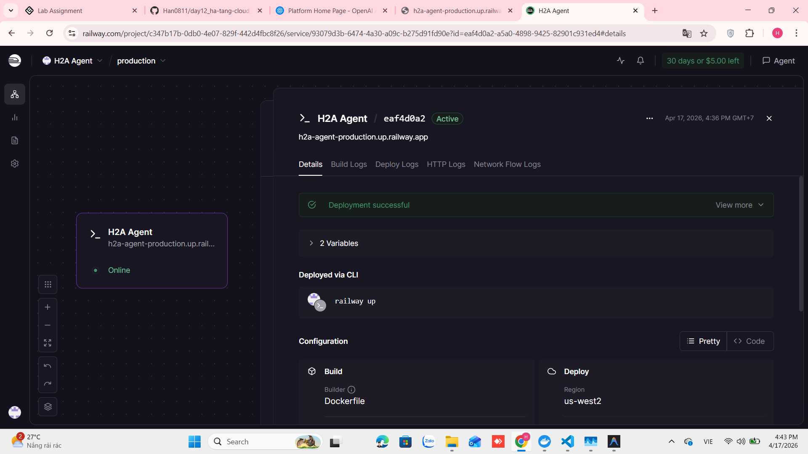
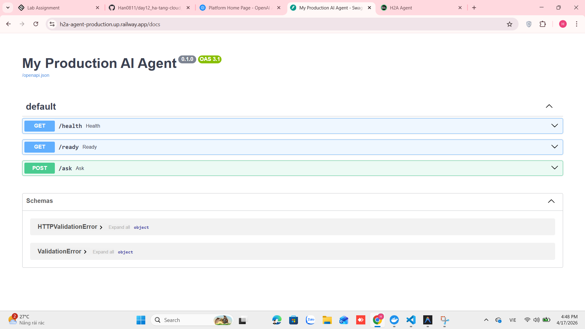
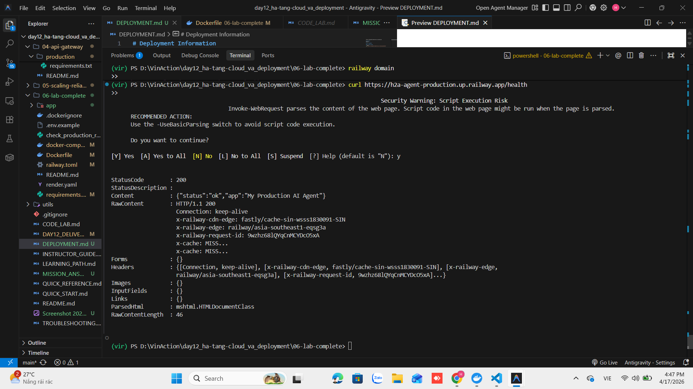

# Deployment Information

## Public URL
https://h2a-agent-production.up.railway.app

## Platform
Railway

## Test Commands

### 1. Health Check
```bash
curl https://h2a-agent-production.up.railway.app/health
```
**Expected:** `{"status": "ok"}`

### 3. Test Rate Limiting (Giới hạn 10 req/phút)
Bạn có thể dùng vòng lặp để test việc bị chặn sau 10 lần gọi:
```bash
for i in {1..12}; do curl -H "X-API-Key: h2a-secret-key" https://h2a-agent-production.up.railway.app/ask; done
```

### 4. Test Cost Guard (Ngân sách)
App sẽ tự động tính phí giả lập mỗi lượt gọi. Khi tổng phí đạt ngưỡng (trong `config.py`), hệ thống sẽ trả về lỗi `402 Payment Required`.

## Environment Variables Set
- `PORT`: 8000
- `AGENT_API_KEY`: h2a-secret-key
- `LOG_LEVEL`: info

## Screenshots

### 1. Giao diện quản lý Railway (Dashboard)


### 2. Dịch vụ đang hoạt động ổn định


### 3. Kết quả kiểm tra API thành công

